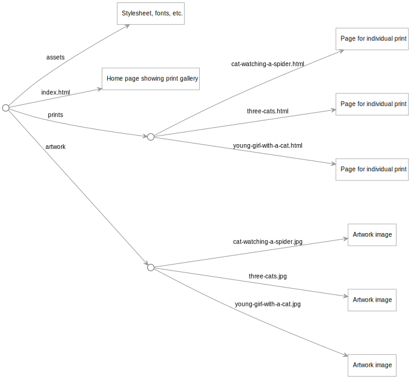

This is the source for [coffeeaardvark.com](https://coffeeaardvark.com), a simple Web Origami project with an online store.

There are a number of online store service providers that allow static site authors to add commerce features. This demo uses [Snipcart](https://snipcart.com/), which is comparatively easy to set up and has a low sales commission. (As of late 2023, this was 2%.)

The overall site structure is defined in [src/site.ori](src/site.ori), and creates one page in the `/prints` area for each print defined in the [src/prints.yaml](src/prints.yaml) data file. Each print page displays the corresponding image.

The script to add shopping cart integration is set up in [src/snipcart.orit](src/snipcart.orit) and uses a public API key.

Create a copy of this project and play with it in a web-based editor: [Remix on Glitch](https://glitch.com/edit/#!/import/github/WebOrigami/coffeeaardvark). Note that the shopping cart is set up in a test mode and won't actually purchase anything.
